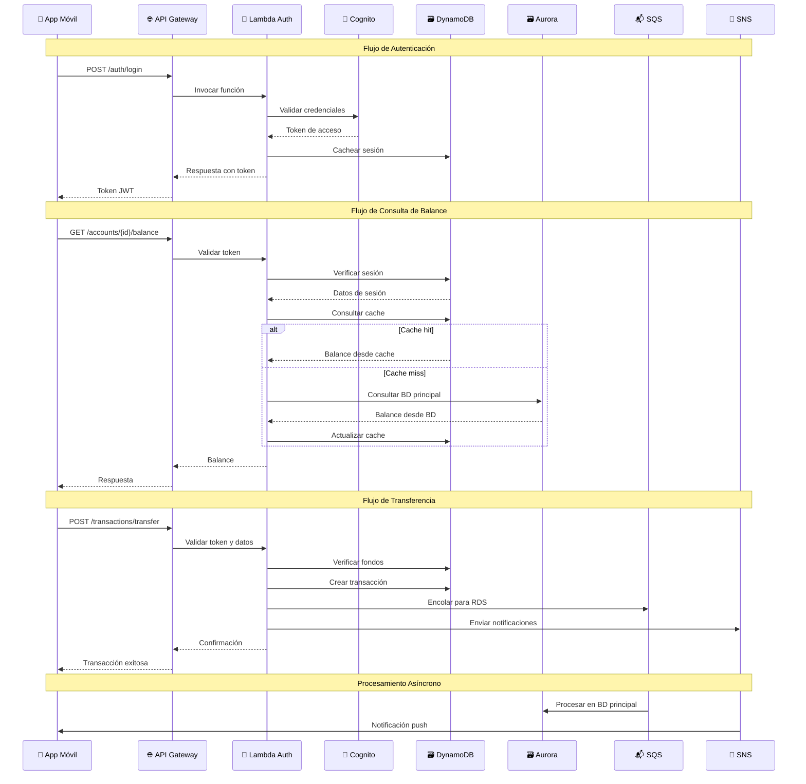
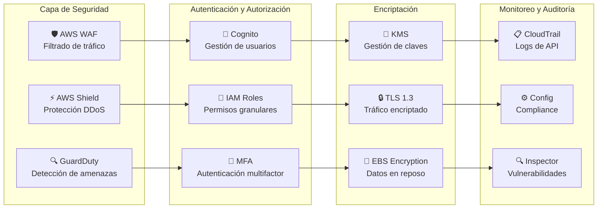

# Diagrama Arquitectónico - Aplicación de Banca Móvil

## Arquitectura Híbrida con Funciones Serverless

```mermaid
graph TB
    %% Cliente Móvil
    subgraph "Cliente"
        MobileApp["📱 Aplicación Móvil<br/>iOS/Android"]
    end
    
    %% Nube Pública (AWS)
    subgraph "Nube Pública (AWS)"
        subgraph "API Layer"
            APIGW["🌐 API Gateway<br/>Punto de entrada único"]
        end
        
        subgraph "Compute Layer"
            LambdaAuth["🔐 Lambda Auth<br/>Login/Register"]
            LambdaAccounts["💳 Lambda Accounts<br/>Balance/Cuentas"]
            LambdaTransactions["💰 Lambda Transactions<br/>Transferencias"]
            LambdaNotifications["📧 Lambda Notifications<br/>Alertas"]
        end
        
        subgraph "Storage Layer"
            DynamoDBUsers["👥 DynamoDB Users<br/>Cache de usuarios"]
            DynamoDBAccounts["🏦 DynamoDB Accounts<br/>Cache de cuentas"]
            DynamoDBTransactions["📊 DynamoDB Transactions<br/>Cache de transacciones"]
            DynamoDBAudit["📝 DynamoDB Audit<br/>Logs de auditoría"]
        end
        
        subgraph "Authentication"
            Cognito["🔑 Cognito User Pool<br/>Autenticación"]
            CognitoClient["📱 Cognito Client<br/>Gestión de sesiones"]
        end
        
        subgraph "Messaging"
            SNS["📨 SNS Topics<br/>Notificaciones"]
            SQS["📬 SQS Queues<br/>Procesamiento asíncrono"]
        end
        
        subgraph "Storage"
            S3["🗄️ S3 Buckets<br/>Documentos/Archivos"]
        end
        
        subgraph "Security"
            KMS["🔐 KMS Keys<br/>Encriptación"]
            SecretsManager["🔒 Secrets Manager<br/>Credenciales"]
        end
        
        subgraph "Monitoring"
            CloudWatch["📊 CloudWatch<br/>Logs y métricas"]
            XRay["🔍 X-Ray<br/>Tracing distribuido"]
        end
    end
    
    %% Nube Privada (RDS)
    subgraph "Nube Privada"
        subgraph "Database Layer"
            AuroraCluster["🗃️ Aurora PostgreSQL<br/>Base de datos principal"]
            AuroraReplica["🗃️ Aurora Replica<br/>Lectura distribuida"]
        end
        
        subgraph "Network"
            VPC["🌐 VPC Privada<br/>Red aislada"]
            PrivateSubnets["🔒 Subnets Privadas<br/>Acceso restringido"]
        end
    end
    
    %% Conexiones principales
    MobileApp --> APIGW
    APIGW --> LambdaAuth
    APIGW --> LambdaAccounts
    APIGW --> LambdaTransactions
    APIGW --> LambdaNotifications
    
    %% Conexiones de autenticación
    LambdaAuth --> Cognito
    Cognito --> CognitoClient
    
    %% Conexiones de almacenamiento
    LambdaAccounts --> DynamoDBAccounts
    LambdaTransactions --> DynamoDBTransactions
    LambdaAuth --> DynamoDBUsers
    
    %% Conexiones de auditoría
    LambdaAuth --> DynamoDBAudit
    LambdaAccounts --> DynamoDBAudit
    LambdaTransactions --> DynamoDBAudit
    
    %% Conexiones a base de datos principal
    LambdaAccounts -.-> AuroraCluster
    LambdaTransactions -.-> AuroraCluster
    
    %% Conexiones de mensajería
    LambdaTransactions --> SQS
    LambdaNotifications --> SNS
    
    %% Conexiones de seguridad
    LambdaAuth --> KMS
    LambdaAccounts --> KMS
    LambdaTransactions --> KMS
    AuroraCluster --> SecretsManager
    
    %% Conexiones de monitoreo
    LambdaAuth --> CloudWatch
    LambdaAccounts --> CloudWatch
    LambdaTransactions --> CloudWatch
    AuroraCluster --> CloudWatch
    
    %% Conexiones de almacenamiento
    LambdaNotifications --> S3
    
    %% Estilos
    classDef aws fill:#ff9900,stroke:#232f3e,stroke-width:2px,color:#fff
    classDef private fill:#0066cc,stroke:#003366,stroke-width:2px,color:#fff
    classDef client fill:#28a745,stroke:#1e7e34,stroke-width:2px,color:#fff
    
    class APIGW,LambdaAuth,LambdaAccounts,LambdaTransactions,LambdaNotifications,DynamoDBUsers,DynamoDBAccounts,DynamoDBTransactions,DynamoDBAudit,Cognito,CognitoClient,SNS,SQS,S3,KMS,SecretsManager,CloudWatch,XRay aws
    class AuroraCluster,AuroraReplica,VPC,PrivateSubnets private
    class MobileApp client
```

## Flujo de Datos Principal

## Componentes de Seguridad

## Patrones de Arquitectura Implementados

### 1. **Serverless Architecture**
- **Beneficios**: Escalabilidad automática, costo por uso, sin gestión de servidores
- **Implementación**: AWS Lambda para lógica de negocio

### 2. **Hybrid Cloud**
- **Nube Pública**: Servicios de AWS para escalabilidad y disponibilidad
- **Nube Privada**: RDS Aurora para datos sensibles con mayor control

### 3. **CQRS (Command Query Responsibility Segregation)**
- **Commands**: Escritura en RDS (base de datos principal)
- **Queries**: Lectura desde DynamoDB (cache)

### 4. **Event-Driven Architecture**
- **Eventos**: Transacciones procesadas asíncronamente
- **Colas**: SQS para desacoplamiento
- **Notificaciones**: SNS para alertas en tiempo real

### 5. **Microservices**
- **Servicios**: Autenticación, cuentas, transacciones, notificaciones
- **Comunicación**: API Gateway como punto de entrada único

### 6. **Security by Design**
- **Defensa en profundidad**: Múltiples capas de seguridad
- **Principio de menor privilegio**: Permisos granulares
- **Encriptación**: Datos en tránsito y en reposo

## Consideraciones de Compliance Bancario

### 1. **PCI DSS**
- Encriptación de datos de tarjetas
- Monitoreo continuo
- Control de acceso estricto

### 2. **SOX (Sarbanes-Oxley)**
- Logs de auditoría completos
- Controles internos
- Segregación de funciones

### 3. **GDPR**
- Protección de datos personales
- Derecho al olvido
- Consentimiento explícito

### 4. **Basel III**
- Gestión de riesgo operacional
- Capital de reserva
- Liquidez adecuada
