# Diagrama Arquitectónico - Aplicación de Banca Móvil

## Arquitectura Híbrida con Funciones Serverless

```mermaid
graph TB
    %% Cliente Móvil
    subgraph "Cliente"
        MobileApp["📱 Aplicación Móvil<br/>iOS/Android"]
    end
    
    %% Nube Pública (AWS)
    subgraph "Nube Pública (AWS)"
        subgraph "API Layer"
            APIGW["🌐 API Gateway<br/>Punto de entrada único"]
        end
        
        subgraph "Compute Layer"
            LambdaAuth["🔐 Lambda Auth<br/>Login/Register"]
            LambdaAccounts["💳 Lambda Accounts<br/>Balance/Cuentas"]
            LambdaTransactions["💰 Lambda Transactions<br/>Transferencias"]
            LambdaNotifications["📧 Lambda Notifications<br/>Alertas"]
        end
        
        subgraph "Storage Layer"
            DynamoDBUsers["👥 DynamoDB Users<br/>Cache de usuarios"]
            DynamoDBAccounts["🏦 DynamoDB Accounts<br/>Cache de cuentas"]
            DynamoDBTransactions["📊 DynamoDB Transactions<br/>Cache de transacciones"]
            DynamoDBAudit["📝 DynamoDB Audit<br/>Logs de auditoría"]
        end
        
        subgraph "Authentication"
            Cognito["🔑 Cognito User Pool<br/>Autenticación"]
            CognitoClient["📱 Cognito Client<br/>Gestión de sesiones"]
        end
        
        subgraph "Messaging"
            SNS["📨 SNS Topics<br/>Notificaciones"]
            SQS["📬 SQS Queues<br/>Procesamiento asíncrono"]
        end
        
        subgraph "Storage"
            S3["🗄️ S3 Buckets<br/>Documentos/Archivos"]
        end
        
        subgraph "Security"
            KMS["🔐 KMS Keys<br/>Encriptación"]
            SecretsManager["🔒 Secrets Manager<br/>Credenciales"]
        end
        
        subgraph "Monitoring"
            CloudWatch["📊 CloudWatch<br/>Logs y métricas"]
            XRay["🔍 X-Ray<br/>Tracing distribuido"]
        end
    end
    
    %% Nube Privada (RDS)
    subgraph "Nube Privada"
        subgraph "Database Layer"
            AuroraCluster["🗃️ Aurora PostgreSQL<br/>Base de datos principal"]
            AuroraReplica["🗃️ Aurora Replica<br/>Lectura distribuida"]
        end
        
        subgraph "Network"
            VPC["🌐 VPC Privada<br/>Red aislada"]
            PrivateSubnets["🔒 Subnets Privadas<br/>Acceso restringido"]
        end
    end
    
    %% Conexiones principales
    MobileApp --> APIGW
    APIGW --> LambdaAuth
    APIGW --> LambdaAccounts
    APIGW --> LambdaTransactions
    APIGW --> LambdaNotifications
    
    %% Conexiones de autenticación
    LambdaAuth --> Cognito
    Cognito --> CognitoClient
    
    %% Conexiones de almacenamiento
    LambdaAccounts --> DynamoDBAccounts
    LambdaTransactions --> DynamoDBTransactions
    LambdaAuth --> DynamoDBUsers
    
    %% Conexiones de auditoría
    LambdaAuth --> DynamoDBAudit
    LambdaAccounts --> DynamoDBAudit
    LambdaTransactions --> DynamoDBAudit
    
    %% Conexiones a base de datos principal
    LambdaAccounts -.-> AuroraCluster
    LambdaTransactions -.-> AuroraCluster
    
    %% Conexiones de mensajería
    LambdaTransactions --> SQS
    LambdaNotifications --> SNS
    
    %% Conexiones de seguridad
    LambdaAuth --> KMS
    LambdaAccounts --> KMS
    LambdaTransactions --> KMS
    AuroraCluster --> SecretsManager
    
    %% Conexiones de monitoreo
    LambdaAuth --> CloudWatch
    LambdaAccounts --> CloudWatch
    LambdaTransactions --> CloudWatch
    AuroraCluster --> CloudWatch
    
    %% Conexiones de almacenamiento
    LambdaNotifications --> S3
    
    %% Estilos
    classDef aws fill:#ff9900,stroke:#232f3e,stroke-width:2px,color:#fff
    classDef private fill:#0066cc,stroke:#003366,stroke-width:2px,color:#fff
    classDef client fill:#28a745,stroke:#1e7e34,stroke-width:2px,color:#fff
    
    class APIGW,LambdaAuth,LambdaAccounts,LambdaTransactions,LambdaNotifications,DynamoDBUsers,DynamoDBAccounts,DynamoDBTransactions,DynamoDBAudit,Cognito,CognitoClient,SNS,SQS,S3,KMS,SecretsManager,CloudWatch,XRay aws
    class AuroraCluster,AuroraReplica,VPC,PrivateSubnets private
    class MobileApp client
```

## Flujo de Datos Principal

```mermaid
sequenceDiagram
    participant MA as 📱 App Móvil
    participant AG as 🌐 API Gateway
    participant LA as 🔐 Lambda Auth
    participant CO as 🔑 Cognito
    participant DB as 🗃️ DynamoDB
    participant RDS as 🗃️ Aurora
    participant SQS as 📬 SQS
    participant SNS as 📨 SNS
    
    Note over MA,SNS: Flujo de Autenticación
    MA->>AG: POST /auth/login
    AG->>LA: Invocar función
    LA->>CO: Validar credenciales
    CO-->>LA: Token de acceso
    LA->>DB: Cachear sesión
    LA-->>AG: Respuesta con token
    AG-->>MA: Token JWT
    
    Note over MA,SNS: Flujo de Consulta de Balance
    MA->>AG: GET /accounts/{id}/balance
    AG->>LA: Validar token
    LA->>DB: Verificar sesión
    DB-->>LA: Datos de sesión
    LA->>DB: Consultar cache
    alt Cache hit
        DB-->>LA: Balance desde cache
    else Cache miss
        LA->>RDS: Consultar BD principal
        RDS-->>LA: Balance desde BD
        LA->>DB: Actualizar cache
    end
    LA-->>AG: Balance
    AG-->>MA: Respuesta
    
    Note over MA,SNS: Flujo de Transferencia
    MA->>AG: POST /transactions/transfer
    AG->>LA: Validar token y datos
    LA->>DB: Verificar fondos
    LA->>DB: Crear transacción
    LA->>SQS: Encolar para RDS
    LA->>SNS: Enviar notificaciones
    LA-->>AG: Confirmación
    AG-->>MA: Transacción exitosa
    
    Note over MA,SNS: Procesamiento Asíncrono
    SQS->>RDS: Procesar en BD principal
    SNS->>MA: Notificación push
```

## Componentes de Seguridad

```mermaid
graph LR
    subgraph "Capa de Seguridad"
        WAF["🛡️ AWS WAF<br/>Filtrado de tráfico"]
        Shield["⚡ AWS Shield<br/>Protección DDoS"]
        GuardDuty["🔍 GuardDuty<br/>Detección de amenazas"]
    end
    
    subgraph "Autenticación y Autorización"
        Cognito["🔑 Cognito<br/>Gestión de usuarios"]
        IAM["👤 IAM Roles<br/>Permisos granulares"]
        MFA["🔐 MFA<br/>Autenticación multifactor"]
    end
    
    subgraph "Encriptación"
        KMS["🔐 KMS<br/>Gestión de claves"]
        TLS["🔒 TLS 1.3<br/>Tráfico encriptado"]
        EBS["💾 EBS Encryption<br/>Datos en reposo"]
    end
    
    subgraph "Monitoreo y Auditoría"
        CloudTrail["📋 CloudTrail<br/>Logs de API"]
        Config["⚙️ Config<br/>Compliance"]
        Inspector["🔍 Inspector<br/>Vulnerabilidades"]
    end
    
    WAF --> Cognito
    Shield --> IAM
    GuardDuty --> MFA
    Cognito --> KMS
    IAM --> TLS
    MFA --> EBS
    KMS --> CloudTrail
    TLS --> Config
    EBS --> Inspector
```

## Patrones de Arquitectura Implementados

### 1. **Serverless Architecture**
- **Beneficios**: Escalabilidad automática, costo por uso, sin gestión de servidores
- **Implementación**: AWS Lambda para lógica de negocio

### 2. **Hybrid Cloud**
- **Nube Pública**: Servicios de AWS para escalabilidad y disponibilidad
- **Nube Privada**: RDS Aurora para datos sensibles con mayor control

### 3. **CQRS (Command Query Responsibility Segregation)**
- **Commands**: Escritura en RDS (base de datos principal)
- **Queries**: Lectura desde DynamoDB (cache)

### 4. **Event-Driven Architecture**
- **Eventos**: Transacciones procesadas asíncronamente
- **Colas**: SQS para desacoplamiento
- **Notificaciones**: SNS para alertas en tiempo real

### 5. **Microservices**
- **Servicios**: Autenticación, cuentas, transacciones, notificaciones
- **Comunicación**: API Gateway como punto de entrada único

### 6. **Security by Design**
- **Defensa en profundidad**: Múltiples capas de seguridad
- **Principio de menor privilegio**: Permisos granulares
- **Encriptación**: Datos en tránsito y en reposo

## Consideraciones de Compliance Bancario

### 1. **PCI DSS**
- Encriptación de datos de tarjetas
- Monitoreo continuo
- Control de acceso estricto

### 2. **SOX (Sarbanes-Oxley)**
- Logs de auditoría completos
- Controles internos
- Segregación de funciones

### 3. **GDPR**
- Protección de datos personales
- Derecho al olvido
- Consentimiento explícito

### 4. **Basel III**
- Gestión de riesgo operacional
- Capital de reserva
- Liquidez adecuada
