# Documentación Técnica - Aplicación de Banca Móvil

## Tabla de Contenidos

1. [Resumen Ejecutivo](#resumen-ejecutivo)
2. [Arquitectura de la Solución](#arquitectura-de-la-solución)
3. [Componentes Técnicos](#componentes-técnicos)
4. [Funciones Serverless](#funciones-serverless)
5. [Infraestructura como Código](#infraestructura-como-código)
6. [Seguridad y Compliance](#seguridad-y-compliance)
7. [Monitoreo y Observabilidad](#monitoreo-y-observabilidad)
8. [Despliegue y Operaciones](#despliegue-y-operaciones)
9. [Consideraciones de Costo](#consideraciones-de-costo)
10. [Roadmap y Mejoras Futuras](#roadmap-y-mejoras-futuras)

## Resumen Ejecutivo

### Objetivo del Proyecto
Diseñar e implementar una arquitectura cloud híbrida para una aplicación de banca móvil utilizando funciones serverless, que cumpla con los estándares de seguridad bancaria y proporcione escalabilidad automática.

### Tecnologías Principales
- **Backend**: AWS Lambda (Python 3.9)
- **Base de Datos**: Aurora PostgreSQL (nube privada) + DynamoDB (cache)
- **Autenticación**: AWS Cognito
- **API**: API Gateway
- **Infraestructura**: Terraform
- **Monitoreo**: CloudWatch + X-Ray

### Beneficios Clave
- ✅ **Escalabilidad Automática**: Adaptación automática a la demanda
- ✅ **Costo Eficiente**: Pago solo por uso real
- ✅ **Alta Disponibilidad**: 99.99% SLA
- ✅ **Seguridad Bancaria**: Cumplimiento PCI DSS, SOX, GDPR
- ✅ **Tiempo de Respuesta**: < 200ms para operaciones críticas

## Arquitectura de la Solución

### Patrón de Nube Híbrida

#### Nube Pública (AWS)
- **Servicios Serverless**: Lambda, API Gateway, DynamoDB
- **Autenticación**: Cognito User Pool
- **Mensajería**: SNS, SQS
- **Almacenamiento**: S3
- **Monitoreo**: CloudWatch, X-Ray

#### Nube Privada (RDS)
- **Base de Datos Principal**: Aurora PostgreSQL
- **Red Aislada**: VPC con subnets privadas
- **Encriptación**: KMS + EBS Encryption

### Flujo de Datos

```mermaid
graph TB
    A[App Móvil] --> B[API Gateway]
    B --> C[Lambda Functions]
    C --> D[DynamoDB Cache]
    C --> E[Aurora PostgreSQL]
    C --> F[SQS/SNS]
    E --> G[Backup Automático]
    D --> H[TTL Expiration]
```



## Componentes Técnicos

### 1. API Gateway
- **Función**: Punto de entrada único para todas las APIs
- **Características**:
  - Rate limiting (1000 req/min por usuario)
  - Validación de esquemas JSON
  - Transformación de respuestas
  - Logging completo de requests

### 2. AWS Lambda Functions

#### Autenticación (`auth/`)
- **login.py**: Autenticación de usuarios
- **register.py**: Registro de nuevos usuarios
- **refresh_token.py**: Renovación de tokens

#### Cuentas (`accounts/`)
- **get_balance.py**: Consulta de balance
- **get_accounts.py**: Lista de cuentas del usuario

#### Transacciones (`transactions/`)
- **transfer.py**: Transferencias entre cuentas
- **get_transactions.py**: Historial de transacciones

#### Notificaciones (`notifications/`)
- **send_notification.py**: Envío de alertas
- **get_notifications.py**: Lista de notificaciones

### 3. Base de Datos Híbrida

#### DynamoDB (Cache)
```python
# Estructura de tablas
users_table = {
    "email": "string",           # Partition Key
    "user_id": "string",          # GSI
    "cognito_user_id": "string",
    "is_active": "boolean",
    "created_at": "string",
    "ttl": "number"              # Auto-expiration
}

accounts_table = {
    "account_id": "string",       # Partition Key
    "user_id": "string",          # GSI
    "account_number": "string",   # GSI
    "balance": "number",
    "currency": "string",
    "is_active": "boolean"
}
```

#### Aurora PostgreSQL (Principal)
```sql
-- Esquema principal
CREATE TABLE users (
    user_id UUID PRIMARY KEY,
    email VARCHAR(255) UNIQUE NOT NULL,
    cognito_user_id VARCHAR(255),
    first_name VARCHAR(100),
    last_name VARCHAR(100),
    phone VARCHAR(20),
    date_of_birth DATE,
    address TEXT,
    is_active BOOLEAN DEFAULT true,
    is_verified BOOLEAN DEFAULT false,
    created_at TIMESTAMP DEFAULT NOW(),
    updated_at TIMESTAMP DEFAULT NOW()
);

CREATE TABLE accounts (
    account_id UUID PRIMARY KEY,
    user_id UUID REFERENCES users(user_id),
    account_number VARCHAR(20) UNIQUE NOT NULL,
    account_type VARCHAR(20) NOT NULL,
    balance DECIMAL(15,2) DEFAULT 0.00,
    currency VARCHAR(3) DEFAULT 'USD',
    is_active BOOLEAN DEFAULT true,
    created_at TIMESTAMP DEFAULT NOW(),
    updated_at TIMESTAMP DEFAULT NOW()
);

CREATE TABLE transactions (
    transaction_id UUID PRIMARY KEY,
    from_account_id UUID REFERENCES accounts(account_id),
    to_account_id UUID REFERENCES accounts(account_id),
    amount DECIMAL(15,2) NOT NULL,
    transaction_type VARCHAR(20) NOT NULL,
    status VARCHAR(20) DEFAULT 'pending',
    description TEXT,
    reference_number VARCHAR(50) UNIQUE,
    created_at TIMESTAMP DEFAULT NOW(),
    updated_at TIMESTAMP DEFAULT NOW()
);
```

## Funciones Serverless

### Estructura de Código

```
serverless/
├── functions/
│   ├── auth/
│   │   ├── login.py
│   │   ├── register.py
│   │   └── refresh_token.py
│   ├── accounts/
│   │   ├── get_balance.py
│   │   └── get_accounts.py
│   ├── transactions/
│   │   ├── transfer.py
│   │   └── get_transactions.py
│   └── notifications/
│       ├── send_notification.py
│       └── get_notifications.py
├── shared/
│   ├── models.py
│   └── utils.py
└── infrastructure/
    ├── main.tf
    └── modules/
```

### Ejemplo de Función Lambda

```python
import json
import logging
from shared.models import APIResponse
from shared.utils import create_response, get_security_context

logger = logging.getLogger()
logger.setLevel(logging.INFO)

def lambda_handler(event, context):
    """
    Handler principal para la función Lambda
    """
    try:
        # Validar método HTTP
        if event.get('httpMethod') != 'GET':
            return create_response(405, APIResponse(
                success=False,
                message="Método no permitido",
                error_code="METHOD_NOT_ALLOWED"
            ))
        
        # Obtener contexto de seguridad
        security_context = get_security_context(event)
        
        if not security_context.user_id:
            return create_response(401, APIResponse(
                success=False,
                message="No autorizado",
                error_code="UNAUTHORIZED"
            ))
        
        # Lógica de negocio aquí
        result = process_request(security_context)
        
        return create_response(200, APIResponse(
            success=True,
            message="Operación exitosa",
            data=result
        ))
        
    except Exception as e:
        logger.error(f"Error en función: {str(e)}")
        return create_response(500, APIResponse(
            success=False,
            message="Error interno del servidor",
            error_code="INTERNAL_ERROR"
        ))

def process_request(security_context):
    """Lógica específica de la función"""
    # Implementación específica
    pass
```

### Configuración de Lambda

```yaml
# serverless.yml
service: banking-app

provider:
  name: aws
  runtime: python3.9
  region: us-east-1
  stage: ${opt:stage, 'dev'}
  
  environment:
    USER_POOL_ID: ${env:USER_POOL_ID}
    COGNITO_CLIENT_ID: ${env:COGNITO_CLIENT_ID}
    USERS_TABLE_NAME: ${env:USERS_TABLE_NAME}
    ACCOUNTS_TABLE_NAME: ${env:ACCOUNTS_TABLE_NAME}
    TRANSACTIONS_TABLE_NAME: ${env:TRANSACTIONS_TABLE_NAME}
    AUDIT_TABLE_NAME: ${env:AUDIT_TABLE_NAME}
    RDS_CLUSTER_ARN: ${env:RDS_CLUSTER_ARN}
    RDS_SECRET_ARN: ${env:RDS_SECRET_ARN}
  
  iam:
    role:
      statements:
        - Effect: Allow
          Action:
            - dynamodb:GetItem
            - dynamodb:PutItem
            - dynamodb:UpdateItem
            - dynamodb:Query
            - dynamodb:Scan
          Resource:
            - "arn:aws:dynamodb:*:*:table/${env:USERS_TABLE_NAME}"
            - "arn:aws:dynamodb:*:*:table/${env:ACCOUNTS_TABLE_NAME}"
            - "arn:aws:dynamodb:*:*:table/${env:TRANSACTIONS_TABLE_NAME}"
            - "arn:aws:dynamodb:*:*:table/${env:AUDIT_TABLE_NAME}"
        - Effect: Allow
          Action:
            - rds-data:ExecuteStatement
          Resource: ${env:RDS_CLUSTER_ARN}
        - Effect: Allow
          Action:
            - secretsmanager:GetSecretValue
          Resource: ${env:RDS_SECRET_ARN}

functions:
  authLogin:
    handler: functions/auth/login.lambda_handler
    events:
      - http:
          path: /auth/login
          method: post
          cors: true
  
  authRegister:
    handler: functions/auth/register.lambda_handler
    events:
      - http:
          path: /auth/register
          method: post
          cors: true
  
  getBalance:
    handler: functions/accounts/get_balance.lambda_handler
    events:
      - http:
          path: /accounts/{account_id}/balance
          method: get
          cors: true
  
  transfer:
    handler: functions/transactions/transfer.lambda_handler
    events:
      - http:
          path: /transactions/transfer
          method: post
          cors: true
```

## Infraestructura como Código

### Estructura de Terraform

```
infrastructure/
├── main.tf                 # Configuración principal
├── variables.tf            # Variables globales
├── outputs.tf              # Outputs del módulo
├── terraform.tfvars        # Valores de variables
└── modules/
    ├── vpc/               # Red y seguridad
    ├── cognito/           # Autenticación
    ├── dynamodb/          # Cache y sesiones
    ├── rds/               # Base de datos principal
    ├── lambda/            # Funciones serverless
    ├── api-gateway/       # API Gateway
    ├── sns/               # Notificaciones
    ├── sqs/               # Colas de mensajes
    ├── monitoring/        # CloudWatch y alertas
    ├── s3/                # Almacenamiento
    └── kms/               # Gestión de claves
```

### Comandos de Despliegue

```bash
# Inicializar Terraform
terraform init

# Planificar cambios
terraform plan -var-file="terraform.tfvars"

# Aplicar cambios
terraform apply -var-file="terraform.tfvars"

# Destruir infraestructura
terraform destroy -var-file="terraform.tfvars"
```

### Variables de Entorno

```hcl
# terraform.tfvars
project_name = "banking-app"
environment  = "production"
aws_region   = "us-east-1"

# Configuración de RDS
rds_instance_class = "db.serverless"
rds_min_capacity   = 0.5
rds_max_capacity   = 16

# Configuración de DynamoDB
dynamodb_billing_mode = "PAY_PER_REQUEST"

# Configuración de Lambda
lambda_timeout = 30
lambda_memory_size = 512
```

## Seguridad y Compliance

### 1. Autenticación y Autorización

#### Cognito User Pool
- **Políticas de Contraseña**: Mínimo 8 caracteres, mayúsculas, minúsculas, números, símbolos
- **MFA**: Opcional con tokens de software
- **Recuperación**: Email y SMS
- **Sesiones**: Tokens JWT con expiración configurable

#### IAM Roles
```json
{
  "Version": "2012-10-17",
  "Statement": [
    {
      "Effect": "Allow",
      "Action": [
        "dynamodb:GetItem",
        "dynamodb:PutItem",
        "dynamodb:UpdateItem",
        "dynamodb:Query"
      ],
      "Resource": "arn:aws:dynamodb:*:*:table/banking-app-*",
      "Condition": {
        "StringEquals": {
          "dynamodb:Attributes": ["user_id"]
        }
      }
    }
  ]
}
```

### 2. Encriptación

#### Datos en Tránsito
- **TLS 1.3**: Todas las comunicaciones HTTPS
- **API Gateway**: Certificados SSL/TLS automáticos
- **RDS**: Conexiones encriptadas

#### Datos en Reposo
- **DynamoDB**: Encriptación AES-256 con claves gestionadas por AWS
- **RDS**: Encriptación EBS + KMS
- **S3**: Encriptación SSE-S3 o SSE-KMS

### 3. Compliance Bancario

#### PCI DSS
- ✅ **Requisito 1**: Firewall y configuración de red
- ✅ **Requisito 2**: Configuración segura de sistemas
- ✅ **Requisito 3**: Protección de datos de tarjetas
- ✅ **Requisito 4**: Encriptación de datos en tránsito
- ✅ **Requisito 5**: Software antivirus
- ✅ **Requisito 6**: Sistemas y aplicaciones seguros
- ✅ **Requisito 7**: Restricción de acceso por necesidad de conocer
- ✅ **Requisito 8**: Identificación única de usuarios
- ✅ **Requisito 9**: Restricción de acceso físico
- ✅ **Requisito 10**: Monitoreo de acceso a datos
- ✅ **Requisito 11**: Pruebas regulares de seguridad
- ✅ **Requisito 12**: Política de seguridad

#### SOX (Sarbanes-Oxley)
- **Controles Internos**: Segregación de funciones
- **Auditoría**: Logs completos de todas las operaciones
- **Reportes**: Dashboards de compliance en tiempo real

#### GDPR
- **Consentimiento**: Registro explícito de consentimiento
- **Derecho al Olvido**: Proceso automatizado de eliminación
- **Portabilidad**: Exportación de datos en formato estándar
- **Privacidad**: Minimización de datos personales

## Monitoreo y Observabilidad

### 1. CloudWatch

#### Métricas Personalizadas
```python
import boto3

cloudwatch = boto3.client('cloudwatch')

def publish_metric(metric_name, value, unit='Count'):
    cloudwatch.put_metric_data(
        Namespace='BankingApp',
        MetricData=[
            {
                'MetricName': metric_name,
                'Value': value,
                'Unit': unit,
                'Timestamp': datetime.utcnow()
            }
        ]
    )
```

#### Dashboards
- **Operacional**: Latencia, throughput, errores
- **Financiero**: Volumen de transacciones, montos
- **Seguridad**: Intentos de acceso fallidos, anomalías
- **Compliance**: Logs de auditoría, controles

### 2. X-Ray Tracing

```python
from aws_xray_sdk.core import xray_recorder
from aws_xray_sdk.core import patch_all

patch_all()

@xray_recorder.capture('process_transaction')
def process_transaction(transaction_data):
    # Lógica de procesamiento
    pass
```

### 3. Alertas y Notificaciones

#### CloudWatch Alarms
```hcl
resource "aws_cloudwatch_metric_alarm" "high_error_rate" {
  alarm_name          = "banking-app-high-error-rate"
  comparison_operator = "GreaterThanThreshold"
  evaluation_periods  = "2"
  metric_name         = "Errors"
  namespace           = "AWS/Lambda"
  period              = "300"
  statistic           = "Sum"
  threshold           = "10"
  alarm_description   = "This metric monitors error rate"
  
  alarm_actions = [aws_sns_topic.alerts.arn]
}
```

## Despliegue y Operaciones

### 1. Pipeline CI/CD

```yaml
# .github/workflows/deploy.yml
name: Deploy Banking App

on:
  push:
    branches: [main]
  pull_request:
    branches: [main]

jobs:
  test:
    runs-on: ubuntu-latest
    steps:
      - uses: actions/checkout@v2
      - name: Set up Python
        uses: actions/setup-python@v2
        with:
          python-version: 3.9
      - name: Install dependencies
        run: |
          pip install -r requirements.txt
          pip install pytest pytest-cov
      - name: Run tests
        run: pytest tests/ --cov=serverless/
      - name: Upload coverage
        uses: codecov/codecov-action@v1

  deploy:
    needs: test
    runs-on: ubuntu-latest
    if: github.ref == 'refs/heads/main'
    steps:
      - uses: actions/checkout@v2
      - name: Configure AWS credentials
        uses: aws-actions/configure-aws-credentials@v1
        with:
          aws-access-key-id: ${{ secrets.AWS_ACCESS_KEY_ID }}
          aws-secret-access-key: ${{ secrets.AWS_SECRET_ACCESS_KEY }}
          aws-region: us-east-1
      - name: Deploy infrastructure
        run: |
          cd infrastructure
          terraform init
          terraform plan
          terraform apply -auto-approve
      - name: Deploy functions
        run: |
          cd serverless
          npm install -g serverless
          serverless deploy --stage production
```

### 2. Gestión de Configuración

#### Variables de Entorno por Ambiente
```bash
# .env.production
USER_POOL_ID=us-east-1_XXXXXXXXX
COGNITO_CLIENT_ID=XXXXXXXXXXXXXXXXXXXXXXXXXX
USERS_TABLE_NAME=banking-app-production-users
ACCOUNTS_TABLE_NAME=banking-app-production-accounts
TRANSACTIONS_TABLE_NAME=banking-app-production-transactions
AUDIT_TABLE_NAME=banking-app-production-audit
RDS_CLUSTER_ARN=arn:aws:rds:us-east-1:123456789012:cluster:banking-app-production-aurora-cluster
RDS_SECRET_ARN=arn:aws:secretsmanager:us-east-1:123456789012:secret:banking-app-production-rds-credentials
```

### 3. Backup y Recuperación

#### RDS Aurora
- **Backup Automático**: 7 días de retención
- **Snapshots Manuales**: Antes de cambios importantes
- **Point-in-Time Recovery**: Hasta 35 días
- **Cross-Region Backup**: Para disaster recovery

#### DynamoDB
- **Point-in-Time Recovery**: Habilitado
- **On-Demand Backup**: Para migraciones
- **Global Tables**: Para multi-región

## Consideraciones de Costo

### Estimación Mensual (1000 usuarios activos)

| Servicio | Costo Estimado | Descripción |
|----------|----------------|-------------|
| Lambda | $50 | 1M requests/mes |
| API Gateway | $35 | 1M requests/mes |
| DynamoDB | $25 | 1M reads/writes |
| RDS Aurora | $200 | Serverless v2 |
| Cognito | $5 | 1000 usuarios |
| SNS/SQS | $10 | Notificaciones |
| CloudWatch | $20 | Logs y métricas |
| **Total** | **$345** | **Por mes** |

### Optimizaciones de Costo

1. **Lambda**: Optimizar tiempo de ejecución y memoria
2. **DynamoDB**: Usar TTL para limpieza automática
3. **RDS**: Configurar auto-pause en horarios de bajo uso
4. **CloudWatch**: Configurar retención de logs apropiada
5. **S3**: Usar Intelligent Tiering para archivos

## Roadmap y Mejoras Futuras

### Fase 1 (Actual)
- ✅ Autenticación básica
- ✅ Consulta de balance
- ✅ Transferencias simples
- ✅ Monitoreo básico

### Fase 2 (3 meses)
- 🔄 Pagos con QR
- 🔄 Notificaciones push
- 🔄 Dashboard de analytics
- 🔄 Integración con bancos externos

### Fase 3 (6 meses)
- 🔄 Machine Learning para detección de fraude
- 🔄 Chatbot con IA
- 🔄 Análisis predictivo
- 🔄 API para terceros

### Fase 4 (12 meses)
- 🔄 Blockchain para transacciones
- 🔄 Open Banking
- 🔄 Servicios financieros avanzados
- 🔄 Expansión internacional

## Conclusión

Esta arquitectura híbrida con funciones serverless proporciona una base sólida para una aplicación de banca móvil moderna, escalable y segura. La combinación de servicios AWS serverless con una base de datos privada Aurora PostgreSQL ofrece el equilibrio perfecto entre escalabilidad, seguridad y control.

### Beneficios Clave Logrados
- **Escalabilidad**: Adaptación automática a la demanda
- **Seguridad**: Cumplimiento con estándares bancarios
- **Costo**: Optimización basada en uso real
- **Mantenimiento**: Infraestructura como código
- **Observabilidad**: Monitoreo completo del sistema

### Próximos Pasos
1. Implementar pruebas de carga
2. Configurar alertas de seguridad
3. Desarrollar dashboard de operaciones
4. Planificar disaster recovery
5. Preparar documentación de usuario final
